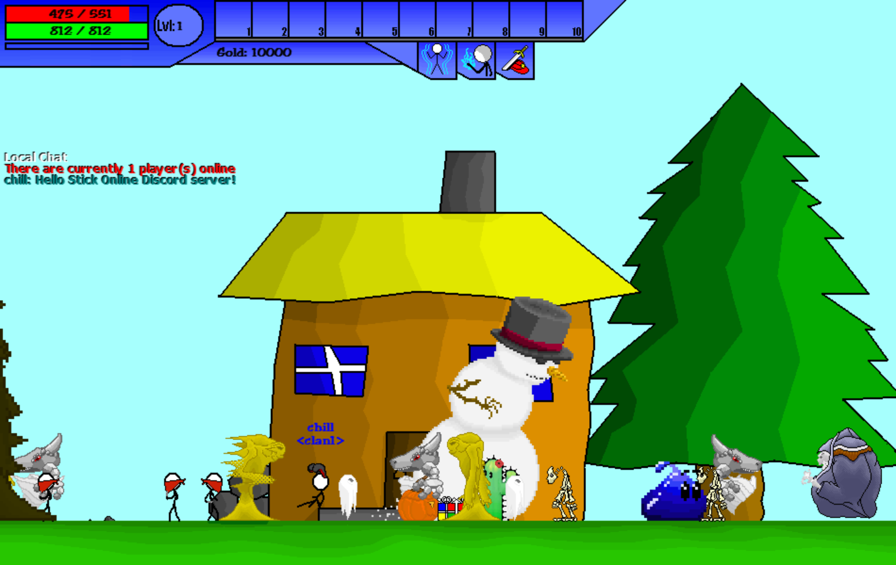

# LocalSO
LocalSO is a cross platform Stick Online server emulator written in Python. It works with the Stick Online client version 0.0227 and implements all features supported by the original game server.

The purpose of this project is to preserve Stick Online for all of its fans. The official server was shut down long ago, and there is no source code available.

## Quick Start
Requirements:
 * Python 2.7

On Windows, run `start_server.cmd` and complete the first time setup:

```
02-03-18 16:24:24 root         INFO     LocalSO v1.0
02-03-18 16:24:24 db           INFO     Connected to database data/stickonline.db
02-03-18 16:24:24 db           INFO     Performing first time setup.
02-03-18 16:24:24 db           INFO     Creating database tables...
02-03-18 16:24:24 db           INFO     Done.
You must register an admin account.
  username: cthill
  password: password
Created admin account cthill
```

On MacOS or Linux, run:
```
$ cd server
$ python src/main.py
```

## Connecting To The Server
Before connecting, obtain a copy of the Stick Online client version 0.0227. It is available at [www.stick-online.com](http://www.stick-online.com/boards/index.php?topic=2.0).

To connect with an unmodified client, you must add two entries to your hosts file. Use notepad or another text editor to add the following two entries to `C:\Windows\System32\drivers\etc\hosts`
```
127.0.0.1	stickonline.redirectme.net
127.0.0.1	www.stick-online.com
```
Start the client and it should connect to the server.

Note: you will not be able to connect to the official www.stick-online.com website without undoing these changes.

## Features
Status of server features.

Feature | Status | Description
--- | --- | ---
Admin Features | ✔️ working | The server supports admin commands prefixed by: `!`. Type `!help` in game for a full list.
Registration | ✔️ working | Accounts are stored in a SQLite database. Usernames are case insensitive just like in the original game.
Login | ✔️ working | See above.
Saving | ✔️ working | The client will periodically send "save" messages which contain current player status (such as spawn point, HP, items, etc.) and are saved in the database.
Chat | ✔️ working | In game chat is supported. Unlike the original game, there is no distance limit on chat messages. Admins can make chat announcements by using the ALT key.
Mobs | ✔️ working | All 19 mobs are fully supported. Mob stats are defined in `data/mob.json` and spawn points in `data/mob_spawn.json`. All mob AI is handled server side.
PVP | ✔️ working | PVP is supported. If a player is in a clan, they can press the `o` key to enable or disable clanmate PVP. \
Clans | ❌ Not Implemented | The client never fully supported clans. It will prevent clanmate PVP and render a clan name below your username. But there is no in game interface for creating or managing clans.
Shops / Gold | ✔️ client-side | Shops and gold are implemented by the client.
Mob Drops | ✔️ client-side | Gold and item drops form mobs are implemented by the client.
Leveling | ✔️ client-side | Experience and leveling are implemented by the client.
HP / MP | ✔️ client-side | HP and MP regeneration as well as death are implemented by the client.

## What Is Stick Online?
Stick Online is a small multiplayer online role playing game from the late 2000's. The game was built using GameMaker and was popular among members of the GameMaker Community. More info can be found at [stick-online.com](http://stick-online.com).

LocalSO is in no way affiliated with Stick Online or Team Stick Online.




## Contributing
Contributions are welcome. If you find a bug or issue with the server, please submit a GitHub issue or pull request.
